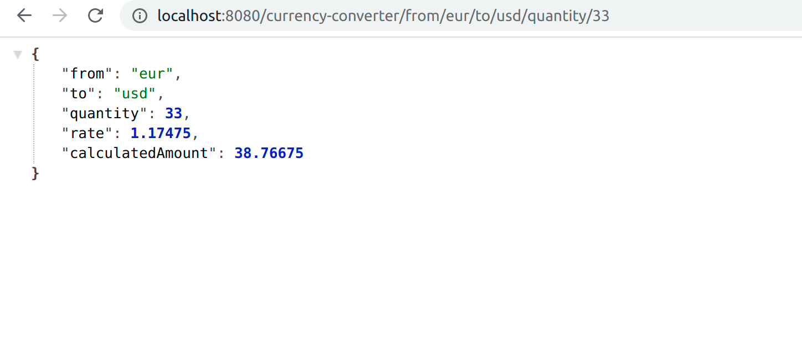

# Currency Convereter Service

I have created the CurrencyConverterService which through the endpoint:http://localhost:8080/currency-converter/from/{from}/to/{to}/quantity/{quantity}  
 gives the possibility to convert the wanted amount. 

eg: http://localhost:8080/currency-converter/from/eur/to/usd/quantity/33
  

## Requirements that i have met
- service gets the data from configured "backing service" , for the moment fixer and
  exchangeratesapi is supported. A task that runs every 5h is fetching the rates and 
  saves them on Redis
  
- backing service is configurable on aplication.properties with the key `spring.rates.provider`
and the base url + api is is stored on `spring.rates.provider.exchangerates` or `spring.rates.provider.fixer`

- the service has unit tests to check the functionality of convertion

- exchange rates are stored on Redis to minimize the api calls
- service is easily extensible to add  other clients to read rates according to the open closed principle